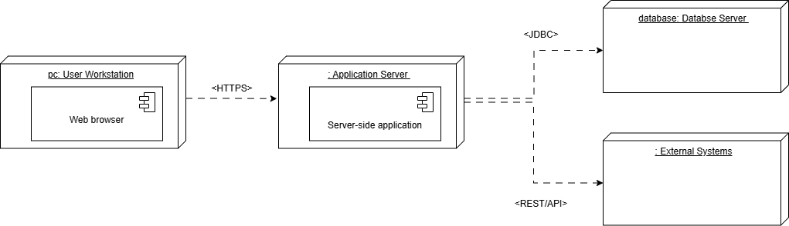

# ADD Iteration 1

## ADD Step 1: Review Inputs

| Category | Details |
|---------|---------|
| **Design Purpose** | This is a greenfield design system developed for use in a university. The purpose of this project is to design a digital assistant that is capable of providing academic information through conversational AI. The goal of the design is to produce a sufficiently detailed and scalable architecture to guide the creation of the AIDAP and guarantee an easy integration into educational institutions. |
| **Primary Functional Requirements** | From the use cases presented in Deliverable 1, the following are primary drivers:  • **UC-1:** Query institution data – because it supports AIDAP’s core business of providing academic information. • **UC-2:** Post announcements and notifications – because it directly supports communication and workflows between faculty and students. • **UC-7:** Synchronize external data – because it addresses the most critical technical challenge of maintaining data consistency across multiple systems (see QA-7). |
| **Quality Attribute Scenarios** | The prioritized quality attributes are listed below.  **Scenario ID – Importance to Customer – Difficulty of Implementation** • **QA-1 Performance** – High – High • **QA-2 Availability** – High – Medium • **QA-3 Scalability** – High – High • **QA-4 Security** – High – High • **QA-5 Modifiability** – Medium – Medium • **QA-6 Usability** – Medium – Low  From this list, QA-1, QA-2, QA-3, and QA-4 are selected as architectural drivers because they are most critical to AIDAP’s success and require specific design trade-offs. |
| **Constraints** | All system constraints identified in Deliverable 1 are included as design drivers:  • **CON-1:** Institutional privacy compliance and data protection. • **CON-2:** Single Sign-On authentication for secure access. • **CON-3:** Cloud-native deployment with scalability based on use. • **CON-4:** Standard REST/GraphQL APIs for interoperability. • **CON-5:** Accessibility through both web browsers and mobile devices. • **CON-6:** Continuous deployment with zero downtime. • **CON-7:** The AI modules shall be implemented using Python-based machine learning frameworks, as the development team is most proficient in Python. |
| **Architectural Concerns** | All previously discussed architectural concerns in Deliverable 1 are considered drivers:  • **CRN-1:** Monitoring of system health and latency. • **CRN-2:** AI performance metric logging. • **CRN-3:** Role-based access control. • **CRN-4:** Backup and restore procedures. • **CRN-5:** Data synchronization consistency. |

## Iteration 1: Establishing an Overall Systems Structure

### Step 2 – Establish Iteration Goal by Selecting Drivers

This is the first iteration in the design of a greenfield system, so the goal of this iteration is to achieve the architectural concern **CRN-1**, which is establishing an overall system structure that guarantees reliability and performance monitoring in the AIDAP platform.

This iteration is guided by a general architectural concern; however, it is important to note all drivers that affect the general structure of the system. Specifically, the most relevant drivers are:

- **QA-1:** Performance  
- **QA-2:** Availability  
- **QA-3:** Scalability  
- **QA-4:** Security  
- **CON-1:** Compliance with institutional privacy and security policies  
- **CON-2:** Secure authentication through Single Sign-On (SSO)  
- **CON-3:** Cloud-native deployment for elastic scalability  
- **CON-4:** Use of standard APIs (REST or GraphQL) for interoperability  
- **CON-5:** Accessibility via web and mobile interfaces  
- **CRN-1:** Monitoring of system health, latency, and errors  
- **CRN-5:** Data synchronization consistency across connected systems  

The purpose of this iteration is to find the overall architectural boundaries of AIDAP, which includes identifying the main system under development, its external systems, and the direction of information flow between them.

### Step 3 – Choose One or More Elements of the System to Refine

This is a greenfield system, so in this case the element to refine is the **entire AIDAP System**, which is shown in the context diagram:

### Step 4 – Choose One or More Design Concepts That Satisfy the Selected Drivers

The table below summarizes the selection of design decisions:

| **Design Decisions and Locations** | **Rationale** |
|-----------------------------------|---------------|
| **Logically structure the client part of the system using the Web Application reference architecture** | The Web Application architecture supports browser-initiated communication with a central server through the HTTP protocol. It organizes the system into three layers: presentation, business, and data, all of which correspond directly to AIDAP’s needs for conversational interaction, AI processing, and database access. This design avoids local installation and ensures portability of the interface across platforms, satisfying CON-5. Because most logic resides on the server, deployment and updates are simplified, aligning with QA-5 (Modifiability) and QA-4 (Security) through centralized control and SSO integration.  **Discarded Alternatives and Reasons for Discarding:**  **Alternative: Rich Internet Application** — Rejected because although it supports a richer interface, it requires more complex client-side processing, which AIDAP does not need.  **Alternative: Rich Client Applications** — Rejected because they require installation on the user’s machine and depend on local resources, violating CON-5 (web accessibility) and complicating deployment.  **Alternative: Mobile Applications** — Rejected because AIDAP must support a broad user base mainly through web/desktop interfaces. A responsive Web Application meets this requirement without separate installations.  **Alternative: Service Applications** — Rejected because AIDAP requires an interactive conversational interface. A mixed web + service architecture was also declined because backend work is handled by the server-side web architecture. |
| **Physically structure the application using the Three-Tier Deployment pattern** | A three-tier deployment consisting of the Presentation Layer (web client), Application Layer (services and AI logic), and Data Layer (database) provides a clear separation of responsibilities. This structure supports independent scaling of the application layer to meet varying user demand (QA-3) and increases fault tolerance (QA-2).  The two-tier model was discarded because AIDAP requires a middle tier for AI processing, and architectures with more than three tiers were rejected as unnecessarily complex. |
| **Implement the conversational engine and all integration modules as Service Applications** | The Service Application framework supports backend functionality through public service interfaces (CON-4). This aligns with AIDAP’s requirement to communicate with institutional systems and external data sources.  **Discarded alternative:** A monolithic backend — rejected because it does not support independent scaling or fault isolation, both of which are required to meet QA-2 (Availability) and QA-3 (Scalability). |
| **Provide user access through standard web browsers using HTTPS communication** | Access to AIDAP is obtained through standard web browsers, satisfying portability and platform accessibility requirements (CON-5). HTTPS ensures secure communication and compliance with institutional data-protection policies (QA-4).  The alternative—native desktop or mobile applications—was rejected because it would require installation and additional maintenance. |
| **Use the Django Web Framework as the Main Application Framework** | Django is selected for the server-side portion of the Web Application reference architecture. Django provides an integrated structure including routing, controllers, business logic modules, template rendering, and an ORM for database interaction. This eliminates the need for an additional Service Application architecture because backend processes such as conversational coordination, data retrieval, and communication with external systems can be handled within Django views, models, and utilities.  This supports QA-5 (Modifiability) through clear module boundaries and supports CON-5 (browser-based accessibility) by simplifying HTML-based presentation creation. |

### Step 5 – Instantiate Architectural Elements, Allocate Responsibilities, and Define Interfaces

The instantiation design decisions considered and made are shown in the following table:

| **Design Decision and Location** | **Rationale** |
|----------------------------------|---------------|
| **Create a module dedicated to accessing institutional systems in the Service Application reference architecture** | The service agents concept from the reference architecture is adapted to provide access to institutional systems such as the LMS, Registration, and Calendar platforms. This will allow for the achievement of UC-1 and UC-7 by centralizing all external data retrieval. This component will also play a critical role in achieving QA-4 (Security) by ensuring that authenticated communication with university systems is handled consistently. |
| **Instantiate a monitoring and logging component in the service layer** | A monitoring agent is instantiated to collect system health data, latency metrics, and error logs across backend services. This contributes to CRN-1 and CRN-2 and supports UC-6 by ensuring that operational data is consistently captured for diagnostic and maintenance purposes. |

### Step 6 – Sketch Views and Record Design Decisions

The diagram below shows the sketch of a module view of the reference architectures selected for the client and server applications:

### **Module View Diagram**

| **Element** | **Responsibility** |
|-------------|--------------------|
| **Presentation Client Side (CS)** | This layer contains modules such as the web browser that control user interaction and use case control flow. It controls user interaction through the browser interface and manages conversational inputs.|
| **Web browser** | This module is the actual web interface through which the user can send requests and receive feedback from the system. |
| **Presentation Server Side (SS)** | This layer contains modules that expose the server-side interface used by the client application. It receives requests from the client-side and maps them to the appropriate backend services.|
| **UI Modules SS** | Render the web interface and capture user inputs. |
| **UI Process Modules SS** | Manage client-side control flow and send requests to server-side service interfaces.|
| **Business SS** | This layer contains modules that perform business logic operations that require processing on the server side. |
| **Business Logic SS** | Implements core business rules and domain-specific computations. Validates inputs passed from the Presentation layers before processing.|
| **Business Workflow SS** | Implements use-case logic and coordinates multi-step operations. |
| **Business Entities SS** | These entities make up the domain model. |
| **Data SS** | This layer provides access to stored information and external data sources. |
| **DB Access Module SS** | This module is responsible for persistence of business entities (objects) into the relational database. It also performs object-oriented to relational mapping and shields the rest of the application from persistence details.|
| **Service Agents SS** | This module acts as the connector between AIDAP and external institutional systems. It handles API calls and external data retrieval. |
| **Cross-Cutting SS** | This layer includes modules whose functionality applies across multiple server-side layers. |
| **Communication Utilities SS** | This module offers shared support functions for other server-side components. |
| **Monitoring and Logging Module SS** | This module records system events, monitors data, and performance metrics.  |
| **Security Module SS** | This module is responsible for enforcing all security-related policies and services that apply across other layers. |
| **External Systems** | This layer represents university-managed systems such as the LMS, Registration, and Calendar services.|

### **Deployment Diagram**

The deployment diagram below illustrates where the components associated with the modules will be deployed:

| **Element** | **Responsibility** |
|-------------|--------------------|
| **User Workstation** | This is the user’s PC, which hosts the browser client and renders the AIDAP interface. |
| **Application Server** | The server that hosts the server-side logic of the application and also serves webpages. |
| **Database Server** | Hosts the relational database storing business entities and logs. |
| **External Systems** | Institutional systems that provide data for UC-1, UC-3, UC-4, and UC-7. |

| **Relationship** | **Description** |
|------------------|-----------------|
| Between client browser and application server | All communication uses HTTPS over RESTful interfaces. |
| Between application server and database server | All database interactions are performed using a secure database access protocol (JDBC).  |
| Between Application Server and External Systems | Communication is performed using REST APIs. |

### Step 7 – Perform Analysis of Current Design and Review Iteration Goal and Achievement of Design Purpose

The following table summarizes the design progress using the Kanban board technique:

| **Not Addressed** | **Partially Addressed** | **Completely Addressed** | **Design Decision Made During the Iteration** |
|--------------------|--------------------------|----------------------------|-----------------------------------------------|
|                    | **UC-1**                 |                            | Selected the Web Application reference architecture, which establishes the client and server-side modules that will support browser-based conversational interaction for querying institutional data. |
|                    | **UC-2**                 |                            | Selected the Web Application reference architecture, which identifies the modules that will handle message posting, announcements, and notifications through the web client. |
|                    | **UC-7**                 |                            | The selection of Service Agents SS establishes the component responsible for communicating with external data sources (LMS, Registration, Calendar). Exact integration protocols will be defined in later iterations. |
| **QA-1**           |                          |                            | No relevant design decisions made, as elements participating in this scenario must first be identified. |
|                    | **QA-2**                 |                            | Introduction of Service Agents SS and the three-tier structure identifies the components responsible for external system communication and failover handling. Interface details are not yet defined. |
|                    | **QA-3**                 |                            | Identification of modules derived from the three-tier deployment pattern indicates where replication and scaling will occur. Specific scaling mechanisms will be addressed in later iterations. |
|                    | **QA-4**                 |                            | Addressed primarily in the Security Module SS, which intercepts and validates all incoming requests before reaching the Service Interfaces SS. |
|                    |                          |  **CON-1**                 | Selecting the Web Application reference architectures ensures centralized control of security policies. |
|                    |                          |  **CON-2**                 | The Web Application architecture ensures browser-based access without installation, supporting SSO authentication for institutional users across platforms. |
|                    | **CON-3**                |                            | The introduction of the 3-tier deployment pattern supports cloud-native scaling. Details will be addressed later. |
|                    | **CON-4**                |                            | The selection of the Web Application reference architecture implicitly satisfies the requirement for using standard APIs (REST/JSON). The client interacts with Django using RESTful HTTP, and Service Agents SS will communicate with external systems through REST endpoints. Exact API definitions will be completed later. |
| **CON-5**          |                          |                            | No relevant decisions made at this stage. |
| **CON-6**          |                          |                            | No relevant decisions made at this stage. |
| **CON-7**          |                          |                            | No relevant decisions made at this stage. |
|                    |                          | **CRN-1**                  | The selection of monitoring/logging modules in the Data SS layer establishes where metrics will be collected. |
|                    | **CRN-2**                |                            | Logging Module SS identified, but logging schema, model instrumentation, and dashboards have not yet been identified. |
| **CRN-3**          |                          |                            | No relevant decisions made at this stage. |
|                    | **CRN-4**                |                            | No steps taken yet, but DB Access Module SS is identified. |
|                    | **CRN-5**                |                            | Service Agents SS identify where synchronization will occur. |
