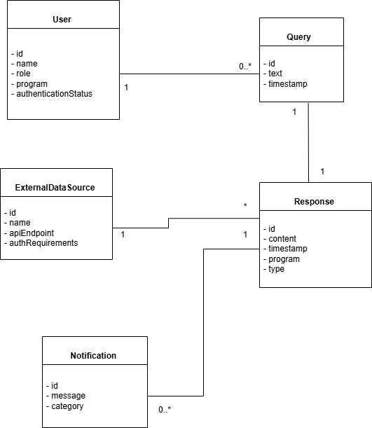
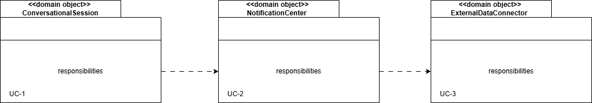
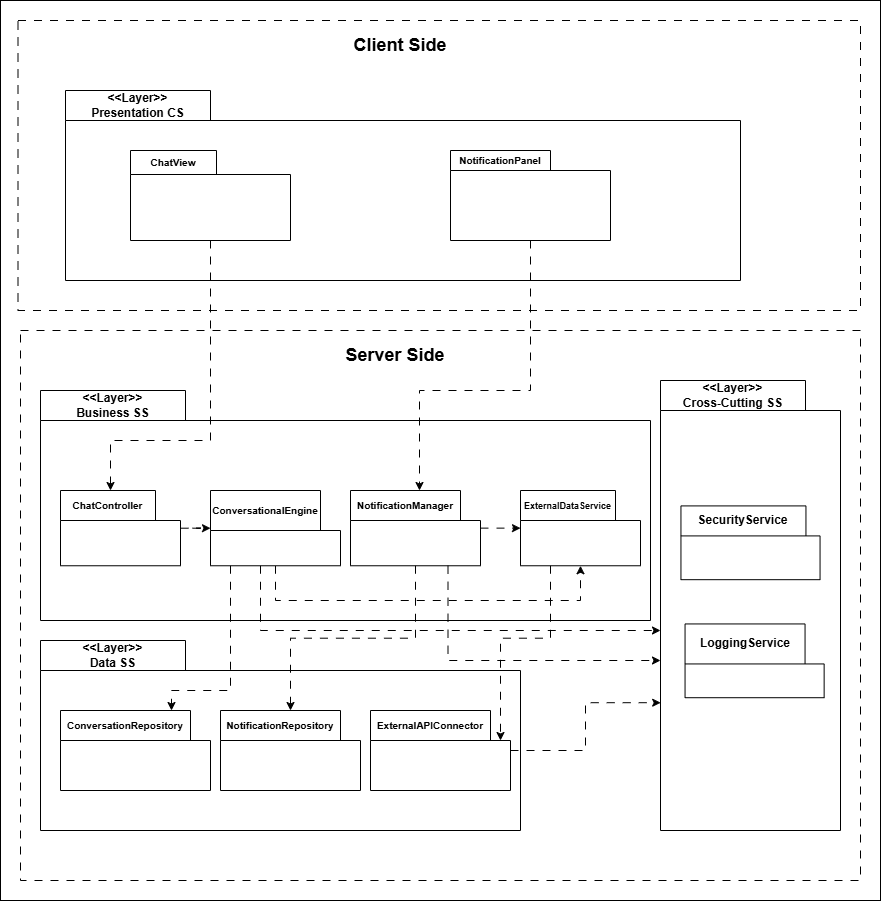
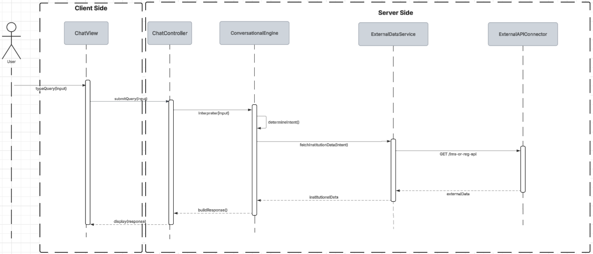
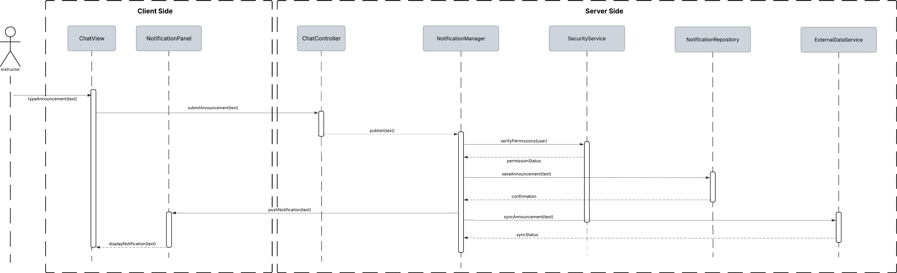
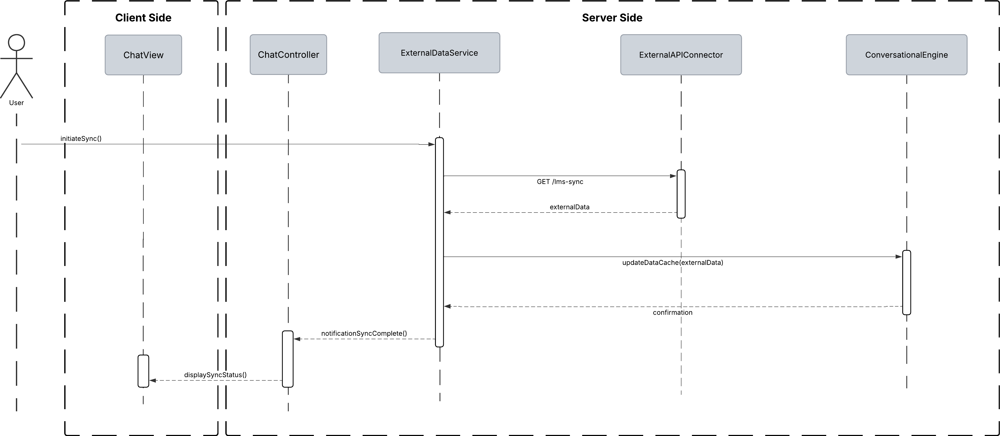

## ADD Iteration 2: Identifying Structures to Support Primary Functionality 

### Step 2 – Establish Iteration Goal by Selecting Drivers

The goal of Iteration 2 is to address the general architectural concern of identifying structures that support primary functionality. Iteration 2 now focuses on the system’s key use cases, which form the basis for identifying the relevant architectural elements.

The primary use cases considered are:

- **UC-1:** Perform Conversational Query  
- **UC-2:** View Announcements & Notifications  
- **UC-7:** Integrate with External Systems (LMS, Registration, Calendar)

### Step 3 – Choose One or More Elements of the System to Refine
In this second iteration, the refinement focuses on the modules located across the layers of the Web Application reference architectures established in Iteration 1. The refinement in this iteration focuses on the modules in the Presentation, Business, Data, and Cross-Cutting layers from both the client and server sides, as these together support the system’s primary functional use cases.

### Step 4 – Choose One or More Elements of the System to Refine

| **Design Decisions and Locations** | **Rationale and Assumptions** |
|------------------------------------|--------------------------------|
| **Create a Domain Model for the application** | Before starting a functional decomposition, it is necessary to create an initial domain model for the system, identifying the major entities in the domain, along with their relationships. There are no good alternatives. A domain model must eventually be created, or it will emerge in a suboptimal fashion, leading to an ad hoc architecture that is hard to understand and maintain. |
| **Identify Domain Objects that Map to Functional Requirements** | Each distinct functional element of the application needs to be encapsulated in a self-contained building block such as a domain object. One possible alternative is to not consider domain objects and instead directly decompose layers into modules, but this increases the risk of not considering a requirement. |
| **Decompose Domain Objects into General and Specialized Components** | Domain objects represent complete sets of functionality, but this functionality is supported by finer elements located within the layers. The “components” in this pattern are what we have referred to as modules. Specialization of modules is associated with the layers where they are located (e.g., UI modules). There are no good alternatives to decomposing the layers into modules to support functionality. |
| **Use Python-based AI framework (PyTorch or TensorFlow) for implementing AIDAP’s AI inference modules** | This supports CON-7 by ensuring that the AI components can be developed efficiently using the programming language most familiar to the team. It also allows integration with Django (Python), ensuring a coherent technology stack and reducing architectural complexity. |

### Step 5 – Instantiate Architectural Elements, Allocate Responsibilities, and Define Interfaces

| **Design Decisions and Location** | **Rationale** |
|----------------------------------|---------------|
| **Create only an initial domain model** | The entities that participate in the primary use cases (UC-1, UC-2, UC-7) need to be identified and modeled, but only a preliminary domain model is created to keep this iteration lightweight. |
| **Map the system use cases to domain objects** | An initial identification of domain objects can be made by analyzing the use cases. This ensures that early functional coverage is maintained.  Mapping UC-1, UC-2, and UC-7 helps identify which components need to collaborate across layers: • **UC-1 →** ConversationalSession, User, ExternalDataSource • **UC-2 →** NotificationCenter, Notification • **UC-7 →** ExternalDataSource, Response, ExternalDataConnector |
| **Decompose the domain objects across the layers to identify layer-specific modules with an explicit interface** | This technique ensures each module supports a cohesive functional responsibility aligned with the AIDAP architecture from Iteration 1. Only the primary use cases are decomposed in this iteration.  The decomposition leads to: • **Presentation CS:** Web browser • **Presentation SS:** UI Modules SS, UI Process Modules SS • **Business Logic SS:** ConversationalEngine SS (with Python-based AI model), NotificationManager SS, ExternalDataService SS • **Data SS:** ExternalDataConnector SS, ConversationRepository SS, NotificationRepository SS • **Cross-Cutting SS:** Security Service, Logging Service |
| **Identify modules that require explicit interfaces** | Because AIDAP is a distributed system that uses external institutional services, certain modules need service boundaries to maintain loose coupling.  Interfaces are identified for: • **ChatController CS → ConversationalEngine SS** (submit query, receive response) • **Business Logic SS → ExternalDataConnector SS** (fetch external data, sync notifications) • **ExternalDataConnector SS → External REST/GraphQL APIs** |
| **Introduce a unified ExternalDataConnector interface to mediate all communication with external institutional systems** | AIDAP relies heavily on retrieving data from external institutional APIs. This introduces **CRN-6**: all external system communication must be abstracted through a unified ExternalDataConnector interface.  This ensures loose coupling between Business Logic SS and external systems, reduces duplication, and supports future integrations without modifying existing workflows. It improves modifiability (QA-5) and isolates external failures to a single module, improving availability (QA-2). |
| **Connect server-side modules using dependency-inversion principles** | To maintain flexibility when integrating Python-based AI models and external institutional APIs, server-side modules are connected using inversion-of-control (IoC). This aligns with **CON-4** (use standard APIs) by ensuring modules interact through REST/GraphQL abstractions and not through tightly coupled code. |
| **Associate the Data SS modules with institutional APIs** | In AIDAP, the system does not own a relational database in Iteration 2. Instead, communication with external systems is through APIs. |

### Step 6 - Sketch Views and Record Design Decisions

### **Initial Domain Model:**

### **Domain objects associated with the use case model:**

### **Modules that support the primary use cases:**

### Module Responsibilities

| **Element** | **Responsibility** |
|-------------|--------------------|
| **ChatView** | Displays the conversation interface and updates when new responses or notifications arrive. This component includes both UI elements and UI process behavior required to support Conversational Querying. |
| **ChatController** | Responsible for coordinating the flow of messages between the presentation layer and the server-side services. This component invokes the ConversationalEngine and manages context retrieval. |
| **NotificationPanel** | Displays announcements and notifications to the user. Responsible for rendering updates pushed by the NotificationManager. |
| **ConversationalEngine** | Contains server-side logic for processing conversational queries, retrieving context, and generating responses. |
| **NotificationManager** | Contains business logic for retrieving, filtering, and managing notifications and announcements. |
| **ExternalDataService** | Contains business logic for orchestrating calls to institutional APIs (LMS, Registration, Calendar). Transforms external API responses into normalized domain data. |
| **ConversationRepository** | Responsible for persistence operations (CRUD) related to Conversations and Messages. Stores query history, timestamps, and inferred context. |
| **NotificationRepository** | Responsible for persistence operations (CRUD) related to notifications and announcements. |
| **ExternalAPIConnector** | Responsible for communication with external institutional systems. |
| **SecurityService** | Contains cross-cutting server-side functionality related to authentication validation, authorization checks, and token inspection. Intercepts incoming requests before reaching the Business Logic layer. |
| **LoggingService** | Responsible for capturing logs, errors, and usage metrics. |

**UC-1: Query Institutional Data**
When a User submits a Query through the ChatView, the request is passed to the ChatController, which forwards the query text to the ConversationalEngine. Using the Query domain object, the ConversationalEngine interprets the user’s input, infers intent, and determines whether additional institutional information is required.
If the detected intent requires external data, the ConversationalEngine requests it from the ExternalDataService, which interacts with the ExternalAPIConnector. This connector retrieves information from the associated ExternalDataSource defined in the domain model. The retrieved data is returned to the ExternalDataService and passed back to the ConversationalEngine.
The ConversationalEngine then constructs a Response domain object containing the final answer, enriched with any external data obtained. This Response is sent back to the ChatController, which updates the ChatView so the User sees the result immediately.

### Method Definitions

| **Method Name** | **Description** |
|------------------|-----------------|
| **Element: ChatView** | |
| `typeQuery(input)` | Captures the user’s natural-language question and forwards it to the ChatController. |
| `display(response)` | Displays the final institutional response back to the user in the UI. |
| **Element: ChatController** | |
| `submitQuery(input)` | Receives the user’s input from the ChatView and passes it to the ConversationalEngine for processing. |
| **Element: ConversationalEngine** | |
| `interpret(input)` | Parses the raw query and extracts the semantic information required for intent classification. |
| `determineIntent()` | Identifies the user’s intent and whether external institutional data is required. |
| `buildResponse()` | Generates a natural-language reply using the retrieved institutional data and returns it to the ChatController. |
| **Element: ExternalDataService** | |
| `fetchInstitutionData(intent)` | Requests institutional information required by the detected intent. |
| **Element: ExternalAPIConnector** | |
| `GET /lms-or-reg-api` | Calls the appropriate institutional API endpoint based on the intent. |
| `externalData (return value)` | Returns the data received from the institutional system back to ExternalDataService. |

**UC-2: Post Announcements and Notifications**
The user submits announcement text through the ChatView. The ChatController forwards it to the NotificationManager on the server, which validates permissions using the SecurityService. Once validated, the announcement is stored as a Notification in the NotificationRepository. Finally, the notification is distributed to subscribed users via the NotificationPanel on the client.

### Method Definitions — Announcement Functionality

| **Method Name** | **Description** |
|------------------|-----------------|
| **Element: ChatView** | |
| `typeAnnouncement(text)` | Captures the instructor’s announcement text input. |
| `displayNotification(text)` | Updates the UI to show the published announcement to the user. |
| **Element: ChatController** | |
| `submitAnnouncement(text)` | Sends the announcement text from the ChatView to the NotificationPanel for publishing. |
| **Element: NotificationPanel** | |
| `publish(text)` | Initiates the process of publishing an announcement by forwarding the text to the NotificationManager on the server side. |
| **Element: NotificationManager** | |
| `verifyPermissions(User user)` | Requests permission validation from the SecurityService based on the user’s role. |
| `saveAnnouncement(text)` | Persists the announcement using the NotificationRepository. |
| `syncAnnouncement(text)` | Sends the announcement to the ExternalDataService to synchronize with institutional systems. |
| `pushNotification(text)` | Sends the published announcement to the NotificationPanel for client-side display. |
| **Element: SecurityService** | |
| `verifyPermissions(User user)` | Confirms whether the user (instructor/admin) is authorized to publish announcements. |
| `permissionStatus` | Determines whether the permission is granted or not. |
| **Element: NotificationRepository** | |
| `saveAnnouncement(text)` | Persists the announcement into the Notification domain object store. |
| **Element: ExternalDataService** | |
| `syncAnnouncement(text)` | Sends announcement data to external APIs for institution-wide broadcast. |

**UC-3: Synchronize External Data**
When the User initiates a sync, the request is handled by the ChatController on the client side. The controller forwards the request to the server-side ExternalDataService, the module responsible for retrieving and coordinating external data updates. The ExternalDataService consults the ExternalAPIConnector to request updated institutional datasets.  The connector performs a GET /lms-sync call and returns the raw externalData. After receiving the data, the ExternalDataService forwards it to the ConversationalEngine, which updates AIDAP’s internal context and cached knowledge. A confirmation message is returned to the ChatController, which notifies the ChatView that synchronization is complete.

| **Method Name** | **Description** |
|------------------|-----------------|
| **Element: ChatController** | |
| `initiateSync()` | Sends a request to synchronize institutional data. Triggered by the user. |
| **Element: ChatView** | |
| `displaySyncStatus()` | Displays a notification to the user that the data sync has been completed. |
| **Element: ExternalDataService** | |
| `syncInstitutionData()` | Requests updated institutional data from external sources. Coordinates the retrieval and updating process. |
| `updateDataCache(externalData)` | Passes the retrieved data to the ConversationalEngine to update the system’s contextual knowledge. |
| **Element: ExternalAPIConnector** | |
| `GET /lms-sync` | Fetches updated institutional data (courses, schedules, enrollment) from the LMS or registration system. |
| `return externalData` | Returns the external data payload to the ExternalDataService. |
| **Element: ConversationalEngine** | |
| `updateContext(externalData)` | Updates conversational context, knowledge base, and program-specific logic using the new institutional data. |
| `confirmation()` | Sends a confirmation message to the ExternalDataService indicating that the update has completed successfully. |

### Step 7 - Perform Analysis of Current Design and Review Iteration

The following table summarizes the design progress using the Kanban board technique:
### Iteration Progress — Kanban Table

| **Not Addressed** | **Partially Addressed** | **Completely Addressed** | **Design Decision Made During the Iteration** |
|-------------------|-------------------------|---------------------------|------------------------------------------------|
|                   |                         | **UC-1**                  | Modules across the layers and preliminary interfaces to support UC-1 – Query institutional data have been identified. |
|                   |                         | **UC-2**                  | Modules across the layers and preliminary interfaces to support UC-2 – Post announcements and notifications have been identified. |
|                   |                         | **UC-7**                  | Modules across the layers and preliminary interfaces to support UC-7 – Synchronize external data have been identified. |
|                   | **QA-1**                |                           | The elements that support the performance-related quality attributes of conversational querying and announcement posting have been identified. |
|                   | **QA-2**                |                           | The elements that support availability and recovery have been partially identified. |
|                   | **QA-3**                |                           | No relevant new decisions were made for the scalability concern in this iteration. Scalability will still be achieved via the underlying web-application architecture and cloud deployment, to be refined later. |
|                   | **QA-4**                |                           | The elements that support secure access and safe use of ExternalDataSource objects have been identified. |
|                   |                         | **CON-1**                 | No new decisions regarding institutional security and privacy compliance were made in this iteration; existing assumptions from Iteration 1 still apply. |
|                   |                         | **CON-2**                 | The introduction of AuthGuard and SecurityService further explains where the institution’s SSO and role-based access controls will be integrated. |
|                   | **CON-3**               |                           | No additional decisions were required for cloud-native deployment in this iteration. |
|                   |                         | **CON-4**                 | The use of ExternalDataService and ExternalAPIConnector refines where standard REST APIs will be used to communicate with ExternalDataSource systems. API-level details will be handled later. |
|                   | **CON-5**               |                           | Modules responsible for presenting cross-channel information to users have been identified. |
|                   | **CON-6**               |                           | Modules responsible for persistent state during rolling deployments have been identified. |
|                   | **CON-7**               |                           | A Python-based implementation is not created in this iteration, but iteration 2 introduces a dedicated ConversationalEngine module with a well-defined interface and isolates AI-related responsibilities within the Business layer SS. The use of dependency-inversion principles and the ExternalAPIConnector prepares the architecture for integrating Python machine-learning frameworks in later iterations. |
|                   |                         | **CRN-1**                 | Modules with all of the associated use cases have been identified. |
|                   | **CRN-2**               |                           | Additional integration technologies (institutional LMS/registration APIs accessible via ExternalAPIConnector) have been identified as the primary means for interacting with ExternalDataSource entities. |
|                   |                         | **CRN-3**                 | Modules associated with all of the primary use cases have been fully identified. |
|                   | **CRN-4**               |                           | The database-access concern is further addressed through the explicit introduction of ConversationRepository and NotificationRepository in the Data SS layer. |
|                   |                         | **CRN-5**                 | The synchronization concern is now fully addressed for the primary external data flows. |
|                   |                         | **CRN-6**                 | Iteration 2 fully introduces a unified ExternalAPIConnector module within the Data SS layer and a corresponding ExternalDataService module in the Business Logic SS layer. Together, they implement the ExternalDataConnector interface that abstracts all communication with institutional systems (LMS, Registration, Calendar). |

