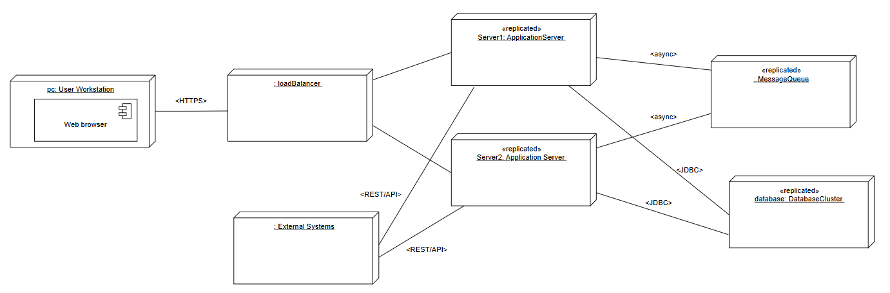
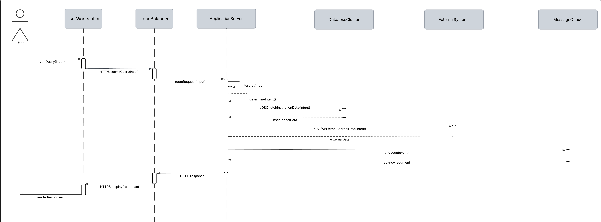

## Iteration 3: Addressing Quality Attribute Scenario Drivers

### Step 2 - Establish Iteration Goal by Selecting Drivers

For this iteration, the architect focuses on three high-priority quality attribute scenarios, all of which were identified as high-importance architectural drivers in Iteration 1. **Primary Drivers for Iteration 3:**

1. **QA-2 – Availability:** The system should stay available 99.5% of the time each month. If a server goes down, the assistant should automatically recover with little or no downtime.
2. **QA-1 – Performance:** When a student provides a natural-language question during normal use, the assistant should reply within 2 seconds on average under normal load.
3. **QA-3 – Scalability:** The assistant should be able to handle up to 5,000 concurrent users without slowing down or losing responses.

The goal of this iteration is to make sure that the physical deployment architecture of AIDAP supports high availability, stable performance, and elastic scalability. By addressing these drivers, the iteration focuses on making the system’s resilience stronger and making sure that AIDAP can continue serving requests despite failures, traffic spikes, or cloud-level disruptions.

### Step 3 - Choose One or More Elements of the System to Refine

For these scenarios, the elements that will be refined are the physical nodes that were identified during the first iteration:

* Application Server
* Database Server
* External Systems (LMS, Registration, Calendar)
* Monitoring and Logging Infrastructure

### Step 4 - Choose One or More Design Concepts that Satisfy the Selected Drivers

The design concepts used in this iteration are the following:

| **Design Decisions and Location** | **Rationale and Assumptions** |
|----------------------------------|-------------------------------|
| Introduce the active redundancy tactic by replicating the application server and database server | By replicating these critical nodes, the system can continue operating even if one instance fails. This supports the availability requirement (QA-2) by ensuring that AIDAP can automatically recover with minimal downtime. Replication also increases throughput and contributes to scalability (QA-3) when handling up to 5,000 users. |
| Introduce an element from the message queue technology family for asynchronous processing | Conversational requests and external-system synchronization events are placed in a message queue and processed by worker components. This separates the Application Server from sudden traffic spikes, thus helping maintain the 2-second response requirement (QA-1). Queues also prevent work from being lost during node failures, improving availability (QA-2) and supporting scalability (QA-3). |
| Introduce caching for frequently accessed institutional and conversational data | Caching reduces repeated database access for common queries, therefore decreasing latency and supporting the performance goal of responding within 2 seconds (QA-1). This reduced database load also improves system stability and supports scalability (QA-3) by allowing many concurrent users. |
| Introduce monitoring and heartbeat-based fault detection for critical components | Monitoring and heartbeat tactics allow the system to detect server failures or slow-responding external APIs. Fast detection supports automatic recovery and 99.5% uptime (QA-2) and enables the system to proactively trigger failover or scale-out events to maintain good performance. |
| Introduce concurrency to support parallel handling of requests and synchronization tasks | Processing events, conversations, and external-system updates in parallel increases throughput and reduces wait times, directly supporting performance (QA-1) and enabling the system to sustain high concurrency (QA-3). |

### Step 5 - Instantiate Architectural Elements, Allocate Responsibilities, and Define Interfaces

| **Design Decisions and Location** | **Rationale and Assumptions** |
|----------------------------------|-------------------------------|
| Deploy the MessageQueue on a separate node | Deploying the message queue on its own node ensures that conversational requests and external-system synchronization events are preserved even if an Application Server replica fails. Separating the queue supports the asynchronous processing tactic introduced in Step 4 by smoothing traffic spikes and preventing lost work, which contributes directly to performance (QA-1) and availability (QA-2). A separate node also allows the queue to grow independently when dealign with high concurrent usage (QA-3). |
| Instantiate two or more ApplicationServer replicas to support active redundancy | Replicating the Application Server allows AIDAP to continue operating even if one replica becomes unavailable. This instantiation directly implements the active redundancy tactic selected in Step 4 and supports the 99.5% uptime requirement (QA-2). The use of multiple active replicas also increases throughput capacity, and allows for both the 2-second response requirement (QA-1) and the 5,000-concurrent user target (QA-3). This instantiation introduces a new architectural concern: CRN-7: Ensuring conversational state and session continuity across replicas. |
| Introduce a LoadBalancer node in front of the ApplicationServer tier | A dedicated LoadBalancer is deployed to distribute incoming traffic across the ApplicationServer replicas and to remove unhealthy replicas using heartbeat and health-check signals. This implements the monitoring and fault detection tactics introduced in Step 4, allowing for both scalability (QA-3) and availability (QA-2) by enabling automatic failover and consistent traffic distribution. |
| Instantiate a DatabaseCluster consisting of a primary node and a single replica | Database replication implements the active redundancy tactic for persistent data. If the primary node fails, the replica makes sure there is uninterrupted data access, supporting availability (QA-2). Read operations can also be offloaded to the replica during high traffic periods, thus improving database responsiveness and contributing to performance (QA-1) and scalability (QA-3). Only one replica is introduced to avoid unnecessary complexity while still meeting the quality attribute goals. |
| Enable caching within the ApplicationServer tier using a lightweight shared cache service | Because caching is a local performance optimization, it is instantiated within each ApplicationServer replica rather than as a separate infrastructure node. This implements the caching tactic selected in Step 4 by reducing database calls and improving request latency during conversational queries, directly supporting performance (QA-1). |

### Step 6 - Sketch Views and Record Design Decisions

The following table describes responsibilities for elements that have not been listed previously (in iteration 1):

| **Element** | **Responsibility** |
|------------|--------------------|
| LoadBalancer | Dispatches and balances incoming HTTPS requests across ApplicationServer replicas. Also performs health checks and removes unhealthy replicas. Presents a unique stable endpoint to clients. |
| MessageQueue | Receives and stores asynchronous requests and events. Guarantees that queued items persist through failures and ensures ordered processing. |
| ApplicationServer (Replicas) | Hosts the server-side logic of AIDAP, including the Conversational Engine, External Data Service, Notification Manager, and cached data. Pulls tasks from the MessageQueue as needed. |
| DatabaseCluster (Primary + Replica) | Stores and manages persistent academic data, conversation logs, and other business entities. Provides read scalability and failover capabilities. |

The diagram below showcases the sequence of messages exchanged between the physical nodes involved in processing a conversational query in UC-1. This diagram reflects the architectural refinements introduced during this iteration, including the LoadBalancer, replicated ApplicationServer nodes, the DatabaseCluster, and the MessageQueue.

When the user submits a natural-language question, the LoadBalancer forwards the HTTPS request to one of the active ApplicationServer replicas. The selected server interprets the query, accesses academic data from the DatabaseCluster, and, if necessary, retrieves additional information from the external institutional systems through REST APIs.

Background synchronization or follow-up tasks are placed into the MessageQueue to be processed asynchronously. Finally, the ApplicationServer sends the computed response back through the LoadBalancer to the UserWorkstation.

The sequence diagram below demonstrates how the newly introduced architectural elements support the performance, availability, and scalability scenarios identified for this iteration.

### Step 7 - Perform Analysis of Current Design and Review Iteration Goal and Achievement of Design Purpose

The following table summarizes the design progress using the Kanban board technique:

| Not Addressed | Partially Addressed | Completely Addressed | Design Decision Made During the Iteration |
|---------------|----------------------|------------------------|-------------------------------------------|
|               | QA-1                 |                        | The introduction of a LoadBalancer and replicated ApplicationServer nodes helps distribute traffic and reduce processing load, improving responsiveness. Caching was also introduced to reduce repeated database calls. Because specific technologies and parameters are not yet finalized, this driver is marked as partially addressed. |
|               |                      | QA-2                   | Availability is fully addressed through server replication, the addition of a LoadBalancer with health-check routing, and a DatabaseCluster with Primary–Replica failover. These decisions ensure the system can remain operational during node failures. |
|               | QA-3                 |                        | Scalability is improved by enabling horizontal scaling through replicated ApplicationServers and asynchronous processing with the MessageQueue. Since automatic scaling policies and consumer scaling rules are still to be defined, this driver is partially addressed. |
|               | QA-4                 |                        | No relevant decisions made. |
|               | CON-3                |                        | Cloud-native deployment concerns are partially addressed by using replicas, load balancing, and queues, but scaling automation is still not completely addressed. |
|               | CON-5                |                        | No relevant decisions made. |
|               | CON-6                |                        | Zero-downtime deployment is partially supported by redundancy and failover mechanisms, but full CI/CD strategies were not specified. |
|               | CON-7                |                        | No relevant decisions made. |
|               | CRN-2                |                        | No relevant decisions made. |
|               | CRN-4                |                        | No relevant decisions made. |
| CRN-7         |                      |                        | This new architectural concern is introduced in this iteration. At this point, no relevant decisions have been made. |
